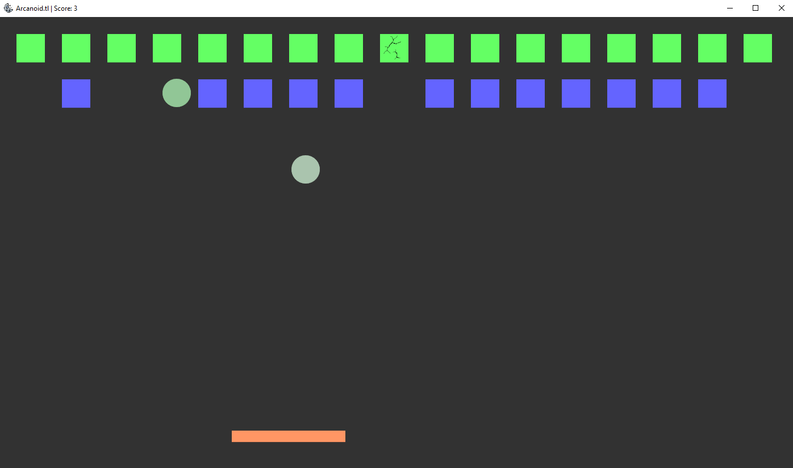

## Arcanoid.tl
> Simple implementation of the famous Arkanoid game, but in the [Teal](https://github.com/teal-language/tl) language.

The game is written using [Moonshine](https://github.com/b0ryakha/Moonshine-Lua-loader).

---

## License
This project is licensed under the GNU GPLv3 License - see the [LICENSE.md](LICENSE.md) file for details
